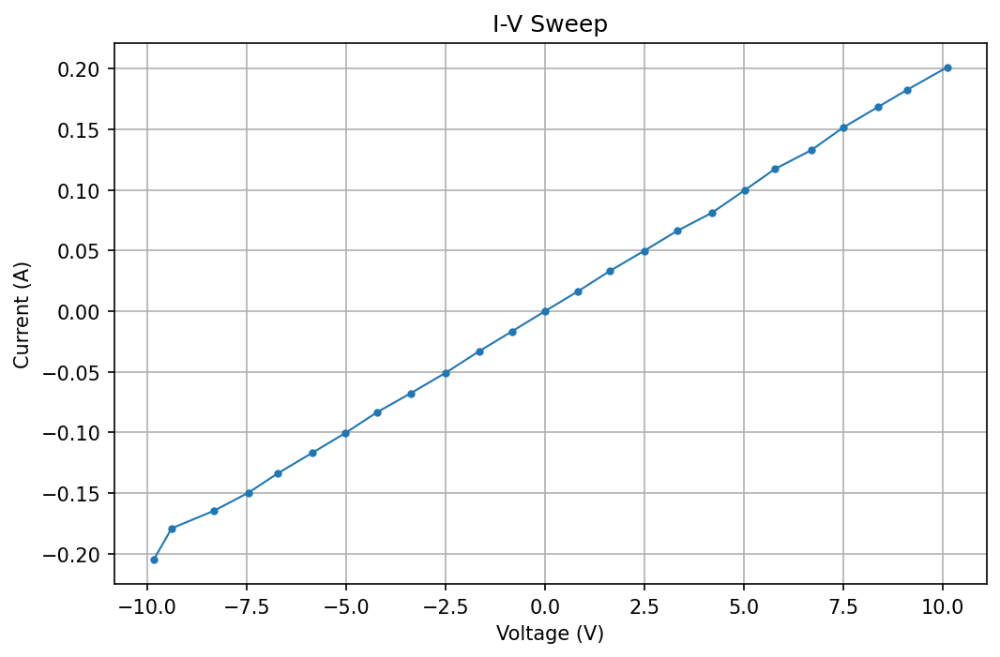
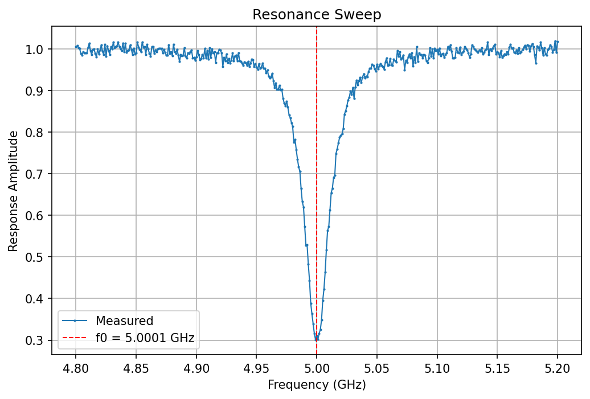

# Python Lab Automation Practice Toolkit

A Python toolkit that simulates instrument-controlled I-V and resonance sweep measurements using mock lab instruments.

## Overview

This project simulates lab automation workflows commonly used in electronics testing, microwave resonator characterization, and hardware labs. It uses **mock instruments** (no real hardware required) to run automated measurements, save timestamped CSV data, generate plots, and perform basic analysis.

The instruments are simulated. The goal is to demonstrate measurement procedure, data handling, plotting, and analysis in a structure that could later connect to real instruments (for example via PyVISA).

## Features

- Mock sourcemeter with connect/disconnect, output enable/disable, and safety checks
- Mock network analyzer for simulated resonance sweeps
- Automated I-V sweep with configurable voltage range and resistance model
- Resonance sweep with Lorentzian dip, noise, curve fitting, and Q-factor estimation
- JSON configuration files for experiment parameters
- Timestamped CSV data logging
- Automatic plot generation with matplotlib
- Resistance estimation from I-V slope
- Safe instrument shutdown using `try` / `finally`
- Modular project layout under `src/`
- `MockSourcemeter.from_config()` for JSON-driven instrument setup
- pytest test suite and GitHub Actions CI

## Installation

**Requirements:** Python 3.10+

```bash
git clone https://github.com/cperezguzman/python_lab_automation_practice_toolkit.git
cd python_lab_automation_practice_toolkit

python3 -m venv .venv
source .venv/bin/activate

pip install -r requirements.txt
```

On Ubuntu/Debian, if `pip install` fails with an `externally-managed-environment` error, use the virtual environment steps above instead of installing packages system-wide.

## Usage

With the virtual environment activated, from the project root:

```bash
# I-V sweep (default config)
python src/main.py --experiment iv

# Resonance sweep (default config)
python src/main.py --experiment resonance

# Custom config file
python src/main.py --experiment iv --config config/iv_sweep_config.json
python src/main.py --experiment resonance --config config/resonance_sweep_config.json
```

### I-V sweep output

```text
Starting I-V sweep...
Connected to sourcemeter.
Enabled sourcemeter output.
Commencing measurement process.
Data saved to data/raw/iv_sweep_2026-05-20_150214.csv
Plot saved to plots/iv/iv_sweep_2026-05-20_150214.png
Estimated resistance: 50.09 ohms
Successfully disabled and disconnected the sourcemeter.
```

### Resonance sweep output

```text
Starting resonance sweep...
Connected to MockNetworkAnalyzer.
Sweeping 4.8 GHz to 5.2 GHz...
Sweep complete.
Data saved to data/raw/resonance_sweep_2026-05-20_152240.csv
Plot saved to plots/resonance/resonance_sweep_2026-05-20_152240.png
Estimated resonance frequency: 5.0001 GHz
Estimated linewidth: 0.0248 GHz
Estimated Q: 201.4
Disconnected from MockNetworkAnalyzer.
```

## Testing

With the virtual environment activated:

```bash
pytest
```

The test suite covers CSV/timestamp utilities, mock sourcemeter safety and Ohm's-law behavior, config loading, I-V sweep output length, and Lorentzian resonance fitting.

## Example configs

Reference copies for documentation and custom runs:

- `examples/example_iv_config.json`
- `examples/example_resonance_config.json`

```bash
python src/main.py --experiment iv --config examples/example_iv_config.json
```

## Configuration

Experiment parameters are stored in JSON files under `config/`:

**`config/iv_sweep_config.json`**

```json
{
  "start_voltage": -10.0,
  "stop_voltage": 10.0,
  "num_points": 25,
  "resistance_ohms": 50,
  "noise_level": "MEDIUM",
  "settling_time_seconds": 0.1
}
```

**`config/resonance_sweep_config.json`**

```json
{
  "start_frequency_ghz": 4.8,
  "stop_frequency_ghz": 5.2,
  "num_points": 401,
  "resonance_frequency_ghz": 5.0,
  "linewidth_ghz": 0.025,
  "noise_std": 0.01,
  "dip_depth": 0.7
}
```

Edit these files to change sweep parameters without modifying Python code.

## Example Output





## Project Structure

```text
python_lab_automation_practice_toolkit/
├── .github/workflows/ci.yml
├── config/
│   ├── iv_sweep_config.json
│   └── resonance_sweep_config.json
├── examples/
│   ├── example_iv_config.json
│   ├── example_resonance_config.json
│   └── screenshots/
├── tests/
├── src/
│   ├── main.py
│   ├── instruments/
│   │   ├── mock_sourcemeter.py
│   │   └── mock_network_analyzer.py
│   ├── experiments/
│   │   ├── iv_sweep.py
│   │   └── resonance_sweep.py
│   ├── analysis/
│   │   ├── iv_analysis.py
│   │   └── resonance_analysis.py
│   ├── plotting/
│   │   ├── plot_iv.py
│   │   └── plot_resonance.py
│   └── utils/
│       ├── config_loader.py
│       └── file_manager.py
├── data/raw/                      # CSV output (gitignored)
├── plots/                         # Plot output (gitignored)
└── examples/screenshots/
```

## Technologies

- Python 3
- NumPy — sweep arrays and linear algebra
- Matplotlib — plotting
- SciPy — Lorentzian curve fitting for resonance analysis
- JSON — experiment configuration
- pytest — automated tests

## Future Improvements

- Mock vs real instrument mode (PyVISA)
- Config schema validation (pydantic/jsonschema)
- Structured logging
- Streamlit dashboard or live plotting
